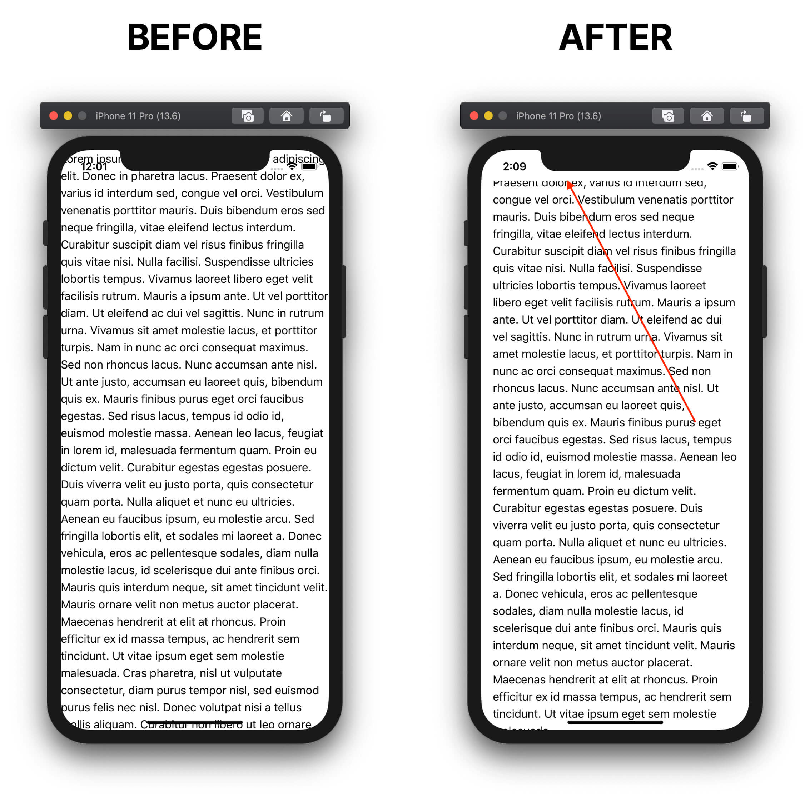

		
	</a>
    Quickly give your app a native feel using Tailwind Utility Classes.

## ✨ What it does

### Features
* ☝️ Account for "the notch" on mobile devices
* 🔦 Disable tap highlight
* 📊 Remove scrollbars